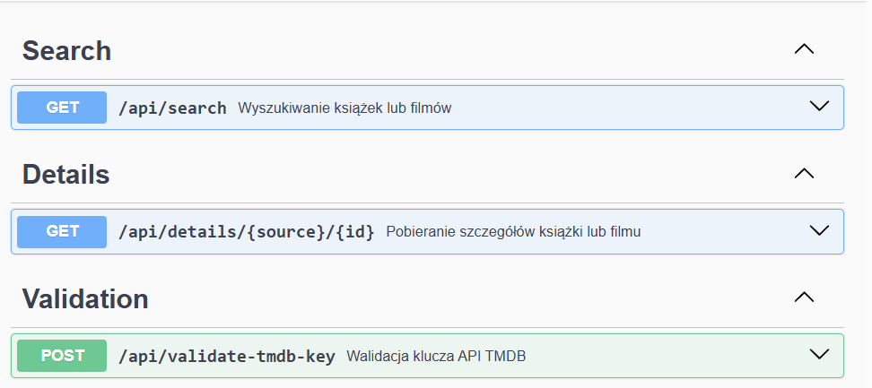

# Testowanie i Jakość Oprogramowania II

## Autor 
Szymon Masłoń

## Opis projektu
Aplikacja do zarządzania kolekcją różnych multimediów. Multimedia są pobierane z API Openlibrary oraz TMDb(przy wcześniejszym podaniu klucza). Multimedia można oznaczać tagami wyznaczonymi przez stronę, oceniać w skali 1-5 gwiazdek, edytować i komentować. Aplikacja pozwala również na dodanie własnych, lokalnych multimediów.

## Uruchamianie projektu

### 1. Instalacja zależności

cd backend  
npm install
cd ../frontend
npm install

### 2. Uruchomienie backendu

cd backend
npm run dev

### 3. Uruchomienie frontendu

cd frontend
npm run dev

### 4. Testy

npm test  
npm run test:unit  
npm run test:integration  

## Testy

### Testy jednostkowe

#### [api.controller.test.js](backend/__tests__/unit/controllers/api.controller.test.js)
- Zwraca błąd 400 gdy brak parametru query
- Zwraca błąd 400 gdy źródło jest nieprawidłowe
- Wywołuje serwis OpenLibrary dla źródła openlibrary
- Wywołuje serwis OpenLibrary przy pobieraniu szczegółów książki

#### [openLibrary.service.test.js](backend/__tests__/unit/services/openLibrary.service.test.js)
- Zwraca sformatowane książki ze wszystkimi polami
- Obsługuje książki bez autora (zwraca "Unknown")
- Rzuca błąd przy niepowodzeniu API
- Zwraca szczegóły książki

#### [tmdb.service.test.js](backend/__tests__/unit/services/tmdb.service.test.js)
- Zwraca sformatowane filmy z kluczem API
- Rzuca błąd gdy brak klucza API
- Limituje wyniki do 10 filmów
- Rzuca błąd przy niepowodzeniu API
- Zwraca szczegóły filmu z poprawnym ID
- Rzuca błąd przy nieprawidłowym ID filmu

### Testy integracyjne

#### [search.integration.test.js](backend/__tests__/integration/search.integration.test.js)
- Zwraca książki z OpenLibrary API
- Zwraca filmy z TMDB API z kluczem
- Zwraca błąd 400 bez parametru query
- Zwraca błąd 400 przy nieprawidłowym źródle

#### [details.integration.test.js](backend/__tests__/integration/details.integration.test.js)
- Zwraca szczegóły książki z OpenLibrary
- Zwraca szczegóły filmu z TMDB
- Zwraca błąd 400 przy nieprawidłowym źródle

#### [validate.integration.test.js](backend/__tests__/integration/validate.integration.test.js)
- Zwraca valid dla poprawnego klucza
- Zwraca invalid dla błędnego klucza
- Zwraca błąd 400 gdy brak klucza

## Dokumentacja API
Dokumentacja znaleziona po uruchomieniu backendu w: http://localhost:5000/api-docs

## Przypadki dla testera manualnego

Testy na trello: https://trello.com/b/62JhDZbX/tijoii

| ID                | TC001                          |
|-------------------|--------------------------------|
| Tytuł             | Wyszukiwanie książek przez OpenLibrary |
| Opis | Sprawdzanie funkcjonalności wyszukiwania książek|
| Warunki początkowe| Aplikacja jest uruchomiona |
| Kroki testowe     | 1. Wybierz źródło API "OpenLibrary". 2. W polu wyszukiwania wpisz "The Lord of the Rings". 3. Naciśnij przycisk "Szukaj". 4. Poczekaj na wyniki wyszukiwania. |
| Oczekiwany rezultat | Lista książek autorstwa Tolkiena wyświetla się na ekranie (maksymalnie 10 wyników). |

---

| ID                | TC002                          |
|-------------------|--------------------------------|
| Tytuł             | Wyszukiwanie filmów przez TMDB |
| Opis |Sprawdzanie funkcjonalności wyszukiwania filmów |
| Warunki początkowe| Aplikacja jest uruchomiona, klucz TMDB API jest skonfigurowany (domyślny lub własny) |
| Kroki testowe     | 1. Wybierz źródło API "TMDB". 2. W polu wyszukiwania wpisz "matrix". 3. Naciśnij przycisk "Szukaj". 4. Poczekaj na wyniki wyszukiwania. |
| Oczekiwany rezultat | Lista filmów zawierających "matrix" w tytule wyświetla się na ekranie (maksymalnie 10 wyników). Każdy film zawiera tytuł, rok, ocenę i plakat. |

---

| ID                | TC003                          |
|-------------------|--------------------------------|
| Tytuł             | Walidacja poprawnego klucza TMDB API |
| Opis | Sprawdzanie funkcjonalności dodawania własnego klucza API|
| Warunki początkowe| Aplikacja jest uruchomiona, użytkownik ma poprawny klucz TMDB API |
| Kroki testowe     | 1. Przewiń do sekcji "TMDB API Key Configuration". 2. Wybierz opcję "Custom API Key". 3. Wklej poprawny klucz API do pola tekstowego. 4. Naciśnij przycisk "Save Configuration". |
| Oczekiwany rezultat | Wyświetla się komunikat "API key is valid". |

---

| ID                | TC004                          |
|-------------------|--------------------------------|
| Tytuł             | Manualne dodawanie media do kolekcji |
| Opis | Sprawdzanie funkcjonalności dodawania własnych pozycji do aplikacji|
| Warunki początkowe| Aplikacja jest uruchomiona, formularz "Add Media Manually" jest widoczny |
| Kroki testowe     | 1. Przewiń do sekcji "Add Media Manually". 2. Wypełnij pole "Title" wartością "1984". 3. Wybierz typ "Book" z listy rozwijanej. 4. Ustaw ocenę na 5 gwiazdek. 5. W polu "Tags" wpisz "sci-fi, drama". 6. W polu "Description" wpisz "A dystopian novel by George Orwell". 7. Naciśnij przycisk "Add to Collection". |
| Oczekiwany rezultat | Nowe media "1984" pojawia się w sekcji "My Collection". Wyświetla się powiadomienie "Media added". Media zawiera wszystkie wprowadzone dane. |

---

| ID                | TC005                          |
|-------------------|--------------------------------|
| Tytuł             | Usuwanie media z kolekcji |
| Opis | Sprawdzanie funkcjonalności usuwania mediów z kolekcji|
| Warunki początkowe| Aplikacja jest uruchomiona, w kolekcji znajduje się przynajmniej jedno media |
| Kroki testowe     | 1. Znajdź wybraną pozycję w sekcji "My Collection". 2. Naciśnij przycisk usunięcia - czerwony X. |
| Oczekiwany rezultat | Media zostaje usunięte z kolekcji i znika z ekranu. Lista kolekcji aktualizuje się automatycznie. |

---

| ID                | TC006                          |
|-------------------|--------------------------------|
| Tytuł             | Aktualizacja oceny gwiazdkowej |
| Opis | Sprawdzanie funkcjonalności aktualizowania oceny mediów w kolekcji. |
| Warunki początkowe| Aplikacja jest uruchomiona, w kolekcji znajduje się media z oceną |
| Kroki testowe     | 1. Znajdź wybrane media w sekcji "My Collection". 2. Kliknij na gwiazdkę reprezentującą nową ocenę.  |
| Oczekiwany rezultat | Ocena media zmienia się na wybraną wartość. Nowa ocena jest widoczna natychmiast bez przeładowania strony. |

---

| ID                | TC007                          |
|-------------------|--------------------------------|
| Tytuł             | Dodawanie komentarza do media |
| Opis | Sprawdzanie funkcjonalności dodawania komentarzy |
| Warunki początkowe| Aplikacja jest uruchomiona, w kolekcji znajduje się przynajmniej jedno media |
| Kroki testowe     | 1. Znajdź wybrane media w sekcji "My Collection". 2. Przewiń do sekcji komentarzy danego media. 3. W polu tekstowym wpisz komentarz "Świetna książka, polecam!". 4. Naciśnij niebieski przycisk "Add" lub Enter. |
| Oczekiwany rezultat | Nowy komentarz pojawia się na liście komentarzy wybranego media. Pole tekstowe zostaje wyczyszczone po dodaniu komentarza. |

---

| ID                | TC008                          |
|-------------------|--------------------------------|
| Tytuł             | Usuwanie komentarza z media |
| Opis | Sprawdzanie funkcjonalności usuwania komentarzy |
| Warunki początkowe| Aplikacja jest uruchomiona, wybrane media ma przynajmniej jeden komentarz |
| Kroki testowe     | 1. Znajdź wybrane media w sekcji "My Collection". 2. Przewiń do sekcji komentarzy danego media. 3. Znajdź komentarz do usunięcia. 4. Naciśnij czerwoną ikonę usuwania X przy komentarzu. |
| Oczekiwany rezultat | Wybrany komentarz zostaje usunięty z listy i znika z ekranu. Pozostałe komentarze pozostają niezmienione. |

---

| ID                | TC009                          |
|-------------------|--------------------------------|
| Tytuł             | Edycja szczegółów media (tytuł, opis) |
| Opis | Sprawdzanie funkcjonalności edytowania szczegółów indywidualnych mediów |
| Warunki początkowe| Aplikacja jest uruchomiona, w kolekcji znajduje się przynajmniej jedno media |
| Kroki testowe     | 1. Znajdź wybrane media w sekcji "My Collection". 2. Naciśnij niebieski przycisk edycji na karcie media. 3. W oknie edycji zmień tytuł na "1984 - Updated". 4. Zmień opis na "A classic dystopian novel". 5. Dodaj tag "horror" do istniejących tagów. 6. Naciśnij zielony przycisk zapisywania "V". |
| Oczekiwany rezultat | Media zostaje zaktualizowane z nowymi danymi. Zmiany są widoczne natychmiast w kolekcji. Okno edycji zamyka się automatycznie po zapisaniu. |

---

| ID                | TC010                          |
|-------------------|--------------------------------|
| Tytuł             | Dodawanie filmów z wyników wyszukiwania |
| Opis | Sprawdzanie dodawania mediów wyszukanych z api |
| Warunki początkowe| Aplikacja jest uruchomiona, wyszukiwanie zostało wykonane i zwróciło wyniki |
| Kroki testowe     | 1. Ustaw źródło na TMDB. 2. Wyszukaj "The Lord of the Rings". 3. Wybierz pozycję z listy wyników. 4. Naciśnij przycisk "Add to Collection" przy wybranym wyniku. |
| Oczekiwany rezultat | Wybrane media zostaje dodane do kolekcji z danymi. Wyświetla się powiadomienie  potwierdzające dodanie. Media pojawia się w sekcji "My Collection" z domyślną oceną 1 gwiazdki. |

## Technologie użyte w projekcie

### Backend
- **Node.js** - środowisko uruchomieniowe JavaScript
- **Express.js** - framework do budowy REST API
- **Axios** - klient HTTP do komunikacji z zewnętrznymi API
- **Vitest** - framework do testowania
- **Supertest** - biblioteka do testów integracyjnych HTTP

### Frontend
- **React 18** - biblioteka do budowy interfejsu użytkownika
- **Vite** - narzędzie do budowania i serwera deweloperskiego
- **TailwindCSS** - framework CSS typu utility-first
- **Axios** - klient HTTP
- **React Hot Toast** - powiadomienia toast
- **Vitest + Testing Library** - testy komponentów React
